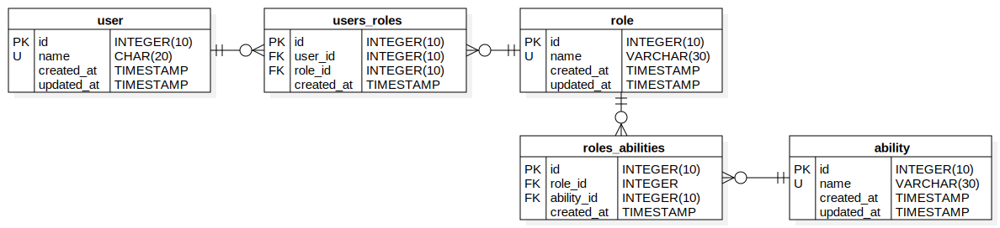

## Тестовое задание от *Alyce*

Для запуска использовать
```bash
sudo ./start.sh
```

You need to design PHP service for maintain and verify user`s roles & abilities.
You can use any technology or DB engine.
Make sure you add comments like you do it when do coding in big team.
Do you best to solve that as if it's production task.
### Functional Requerements:
1. Users related to roles as many-to-many
2. Abilities related to roles as many-to-many
3. Need to define and implement service interface which allows
   - Adding new roles and abilities
   - Remove roles and abilities
   - Attaching and detaching roles to users
   - Checking user`s role or ability
### Non functional requirements
1. You need to define interface as much simple as possible to easy make roles and abilities checking accross the project
2. Role checking should be constant complexity
3. Ability checking should be constant complexity


## Uml Schema of DB
<p align="center"></p>
